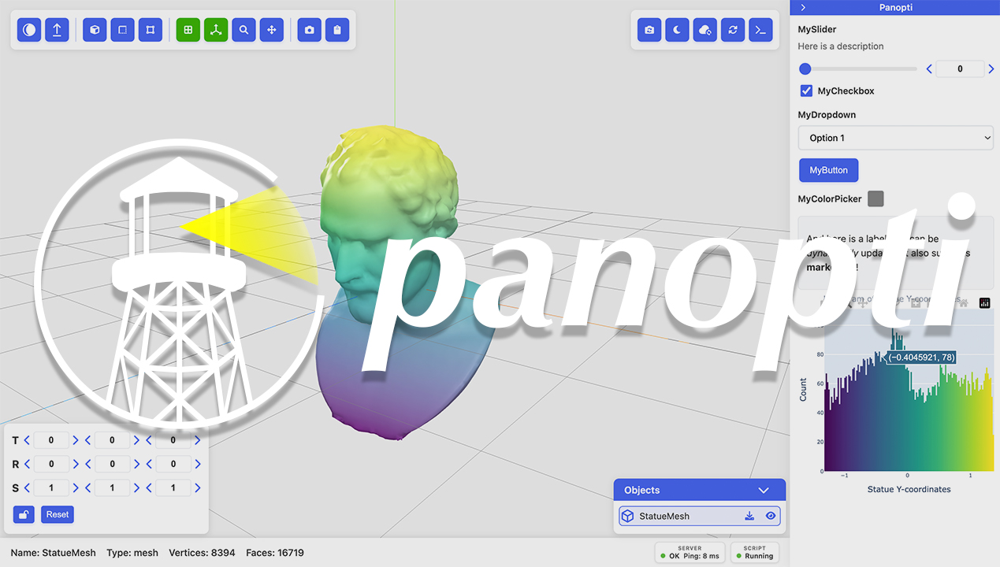

<h1>
  Panopti:<br>
  <sub>Interactive 3D Visualization in Python</sub>
</h1>



## [ [Documentation](https://armanmaesumi.github.io/panopti/) ] - [ [PyPI](https://pypi.org/project/panopti/) ]

Panopti is a Python package for interactive 3D visualization that is designed so that users only need to write Python code, making it painless to setup interactive experiments and scenes. All code examples and demos throughout the documentation are achieved purely using Panopti in Python -- no JavaScript required!

Panopti offers several features:
- ✅ Remote SSH compatible
- ✅ Headless rendering
- ✅ Geometric primitives: meshes, point clouds, animated geometry, etc.
- ✅ Interactive UI elements with Python callbacks
- ✅ Programmable events: on-click, inspection tool, transformation gizmo, camera update, etc.
- ✅ Programmable events: on-click, hover, inspection tool, transformation gizmo, camera update, etc.
- ✅ Convenience features: exporting geometry, mirroring console output, embedding Plotly figures
- ✅ Material customization

See the [docs](https://armanmaesumi.github.io/panopti/) for more!

Install from pip:
```
pip install panopti
```

# Simple example
First start a Panopti server in a separate terminal:
```bash
python -m panopti.run_server --host localhost --port 8080
```

Then you can easily define your scene, for example:
```python
import panopti
import trimesh # just for io
import numpy as np

# create panopti client that connects to server:
viewer = panopti.connect(server_url="http://localhost:8080", viewer_id='client')
# open viewer in browser: http://localhost:8080/?viewer_id=client

mesh = trimesh.load('./examples/demosthenes.obj')
verts, faces = mesh.vertices, mesh.faces

# add a mesh to the scene:
viewer.add_mesh(
    vertices=verts,
    faces=faces,
    name="Statue"
)

def callback_button(viewer):
    # Update mesh vertices on button press by adding Gaussian noise
    statue = viewer.get('Statue')
    noise = np.random.normal(scale=0.05, size=statue.vertices.shape)
    new_verts = statue.vertices + noise
    statue.update(vertices=new_verts)

viewer.button(callback=callback_button, name='Click Me!')

viewer.hold() # prevent script from terminating
```
For more examples see [Documentation](https://armanmaesumi.github.io/panopti/examples/importing_geometry/) or `/examples`

### Hover callbacks
You can listen for hover events similar to inspect:

```python
@viewer.events.hover(throttle=100)
def on_hover(viewer, info):
  # info is an InspectInfo dataclass (same as inspect event)
  print('Hovering over', info.object_name, 'at', tuple(info.screen_coords))
```

## Installation

To install from pip:
```bash
pip install panopti
```

To install from source:
```bash
git clone https://github.com/ArmanMaesumi/panopti

# build frontend viewer
cd panopti/frontend
npm install
npm run build
cd ..

# install python package
pip install .
```

### Dependencies

Core dependencies:
```bash
pip install numpy eventlet requests flask flask-socketio python-socketio[client] tomli msgpack trimesh
```

Optional dependencies:
```bash
pip install matplotlib      # for colormap utilities
pip install plotly==5.22.0  # for plotly figure support
```

Doc-related dependencies:
```bash
pip install mkdocs mkdocs-material mkdocstrings mkdocstrings-python
```

---

### Development

Details for running the local development workflow can be found in: [`/frontend/README.md`](/frontend/README.md)

#### Cite as

```bibtex
@misc{panopti,
  title = {Panopti},
  author = {Arman Maesumi},
  note = {https://github.com/ArmanMaesumi/panopti},
  year = {2025}
}
```